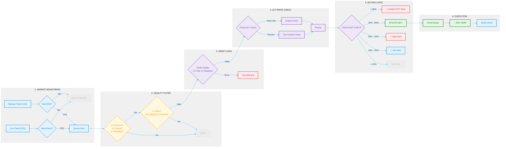

```mermaid
---
config:
  theme: base
  themeVariables:
    primaryColor: '#ffffff'
    primaryTextColor: '#222831'
    primaryBorderColor: '#333333'
    lineColor: '#00aaff'
    secondaryColor: '#e3f2fd'
    tertiaryColor: '#f0f0f0'
  layout: lr
---
flowchart LR
 subgraph subGraph0["1. MARKET MONITORING"]
        B1{"New Event?"}
        A1["Live Feed (0.5s)"]
        B2{"New Mint?"}
        A2["Backup Feed (0.3s)"]
        X1["Ignore Duplicate"]
        Q["Queue Item"]
  end
 subgraph subGraph1["2. QUALITY FILTER"]
        D{"Is Pokemon?<br>Is Graded?<br>Is PSA/BGS?"}
        X2["Ignore"]
        E{"Is Clean?<br>(No Blacklist Keywords)"}
  end
 subgraph subGraph2["3. VERIFY DATA"]
        F{"Verify Details<br>CC Site vs Database"}
        W["Log Warning"]
  end
 subgraph subGraph3["4. ALT PRICE CHECK"]
        G{"Check ALT Cache"}
        V1["Use Cached Value"]
        V2["Instant Fetch"]
        K["Ready"]
  end
 subgraph subGraph4["5. BUYING LOGIC"]
        L{"DISCOUNT CHECK"}
        HONEY["🚨 HONEYPOT RISK"]
        AUTO["🔥 AUTO-BUY"]
        HIGH["🔴 High Alert"]
        INFO["🔵 Info Alert"]
        SKIP["Skip Deal"]
  end
 subgraph subGraph5["6. EXECUTION"]
        M["Fetch Buyer"]
        N["🚀 BUY NOW"]
        O["Notify Client"]
  end
    A1 --> B1
    A2 --> B2
    B1 -- NO --> X1
    B2 -- NO --> X1
    B1 -- YES --> Q
    B2 -- YES --> Q
    Q --> D
    D -- No --> X2
    D -- Yes --> E
    E -- No --> X2
    E -- Safe --> F
    F -- Error --> W
    F -- Valid --> G
    G -- Recent --> V1
    G -- New/ Old --> V2
    V1 --> K
    V2 --> K
    K --> L
    L -- > 85% --> HONEY
    L -- "30% - 85%" --> AUTO
    L -- "20% - 30%" --> HIGH
    L -- "15% - 20%" --> INFO
    L -- &lt; 15% --> SKIP
    AUTO --> M
    M --> N
    N --> O

     B1:::scanner
     A1:::scanner
     B2:::scanner
     A2:::scanner
     X1:::ignore
     Q:::scanner
     D:::filter
     X2:::ignore
     X2:::ignore
     E:::filter
     F:::check
     W:::danger
     G:::check
     V1:::check
     V2:::check
     K:::check
     L:::check
     HONEY:::danger
     AUTO:::autobuy
     HIGH:::danger
     INFO:::scanner
     SKIP:::ignore
     M:::autobuy
     N:::autobuy
     O:::scanner
    classDef base fill:#ffffff,stroke:#222831,stroke-width:1px,color:#222831
    classDef scanner fill:#e3f2fd,stroke:#0288d1,stroke-width:2px,color:#0288d1
    classDef filter fill:#fff8e1,stroke:#ffb300,stroke-width:2px,color:#ff9100
    classDef check fill:#ede7f6,stroke:#7c43bd,stroke-width:2px,color:#7c43bd
    classDef autobuy fill:#e8f5e9,stroke:#43a047,stroke-width:3px,color:#43a047,font-weight:bold
    classDef danger fill:#ffebee,stroke:#d32f2f,stroke-width:2px,color:#d32f2f
    classDef ignore fill:#ececec,stroke:#bdbdbd,stroke-width:1px,color:#bdbdbd,stroke-dasharray: 4 4
```