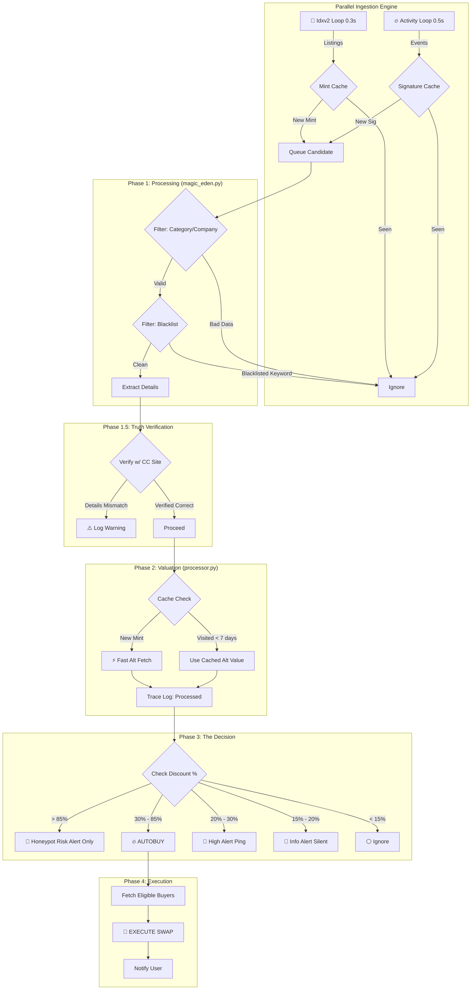

# 🏭 The "Sniper Factory" Architecture

This document outlines the **Fail-proof Assembly Line** for the Cards Cartel Sniper.
It is designed to be **Instant**, **Strict**, and **Automated**.

## 1. The Pipeline Overview (Mermaid Flow)

## 2. Detailed "Assembly Line" Steps

### Step 1: The Parallel Firehose (Ingestion)
We use a **Dual-Engine Approach** to guarantee speed and coverage.

#### Engine A: The Sprinter (Activity Loop)
*   **Source**: `v2/collections/collector_crypt/activities`
*   **Speed**: 0.5s interval.
*   **Role**: Catches listings the *instant* they hit the blockchain.
*   **Deduplication**: **Signature Cache**. Once a unique event signature is seen, it is ignored forever.

#### Engine B: The Tank (Idxv2 Loop)
*   **Source**: `/idxv2/getListedNftsByCollectionSymbol`
*   **Speed**: 1.0s interval.
*   **Role**: Reliable backup. Catching items that might slip through activity feed or initial startup.
*   **Deduplication**: **Mint Cache**. Compares against Database + Runtime Set of processed Mints.

### Step 2: Quality Control & Trace Logging
Located in `magic_eden.py` and `processor.py`.
Every decision is now **Trace Logged** to the console:
*   `✨ [Processed]`: Item accepted.
*   `⚠️ [Skipped]`: Item rejected (with specific reason: Blacklist, Data Error, Zero Price).

1.  **Category Check**: Must be `Pokemon`.
2.  **Company Check**: Must be `PSA`, `BGS`, or `BECKETT`.
3.  **Blacklist Check**: Rejects keywords (e.g., "sticker").
4.  **Data Integrity**: Ensures Price > 0 and Attributes exist.

### Step 3: Fast Valuation (The Speed Layer)
Located in `processor.py`:
*   **Goal**: Determine value in < 200ms.
*   **Method**: `alt.get_alt_data_async(..., fast_mode=True)`
*   **Logic**: 
    *   Fetches **ONLY** the Valuation data from Alt.
    *   **SKIPS** the full transaction history (which is slow).
    *   **SKIPS** the graph data.
    *   *Result*: We get the `Fair Value` instantly.

### Step 4: The Decision (Thresholds)

> [!NOTE]
> **V1 Architecture Note**: Thresholds are currently **GLOBAL (HARDCODED)** for stability.
> Personalized thresholds per user-wallet are planned for V2.
> Currently, the rules below apply to ALL users.

We compare `Listing Price` vs [`Alt Fair Value`](#step-3-fast-valuation-the-speed-layer):
*   **Honeypot Risk** (> 85% Discount): **ALERT ONLY**. Too good to be true. Likely fake collection/hacked wallet.
*   **AUTOBUY** (30% - 85% Discount): **EXECUTED**. The sweet spot.
*   **HIGH Alert** (20% - 30% Discount): **PING RED**. High priority manual review.
*   **INFO Alert** (15% - 20% Discount): **PING SILENT**. Good deal, maybe profitable.
*   **IGNORE** (< 15% Discount): **SKIP**. Loss deal (After fees/slippage).

### Step 5: The "Shotgun" (Execution)
If `AUTOBUY` is triggered:
1.  **Fetch Buyers**: Find all users who:
    *   Have `auto_buy_enabled = True`
    *   Have `max_price >= Listing Price`
    *   Have `min_price <= Listing Price`
2.  **Sort by Priority**: VIP users get first shot.
3.  **Execute**: Uses `transactions.execute_buy` (Jito Bundles / Priority Fees) to land the tx in the next block.

## 3. Why This is "Fail-Proof"
1.  **No Lag**: We use the Activity Feed (proven fastest).
2.  **No Ghosts**: We listen to `delist` events to keep the DB clean.
3.  **No Trash**: Strict Category/Blacklist filters prevent buying garbage.
4.  **No Waste**: "Fast Mode" valuation prevents wasting bandwidth on graph data for snipes.
5.  **Safety**: We only Autobuy at **30% Discount** (High safety margin).

---
**Status**: Ready for Deployment 🟢

## 4. Implementation Status & TODO

### Phase 1: Ingestion (Magic Eden) ✅
- [x] Switch to `v2/activities` (Real-time Feed).
- [x] Handle `delist`/`sale` events (Ghost Listing Fix).
- [x] Filter: Pokemon Only + PSA/BGS/Beckett Only.
- [x] Filter: Strict Blacklist (User Configurable).

### Phase 1.5: Truth Verification (Collector Crypt) ✅
- [x] Create `collector_crypt.py` module.
- [x] Implement Scraping for Metadata (Grade, Company, Name).
- [x] Integrate `verify_match` into Pipeline.

### Phase 2: Valuation & Safety (Alt) ✅
- [x] Implement "Fast Mode" Valuation (Price Only).
- [x] Implement **Keyword Mismatch Logic** (Stamp/Variant Safety).
- [x] Add "Undetermined" Alert for ambiguous cases.

### Phase 3: Execution ✅
- [x] Implement **Max Discount Cap** (>80% Block).
- [x] Implement Priority Autobuy Logic (-30% Trigger).

### Phase 4: Verification & Testing (User Action) ⏳
- [ ] **Restart Bot**: Create new connection to pick up code changes.
- [ ] **Monitor Snorlax Case**: Verify parsing works on provided URL.
- [ ] **Dry Run**: Watch logs for "CC Verified" tag.
- [ ] **Validate**: Confirm Ghost Listings disappear from Admin Panel.

